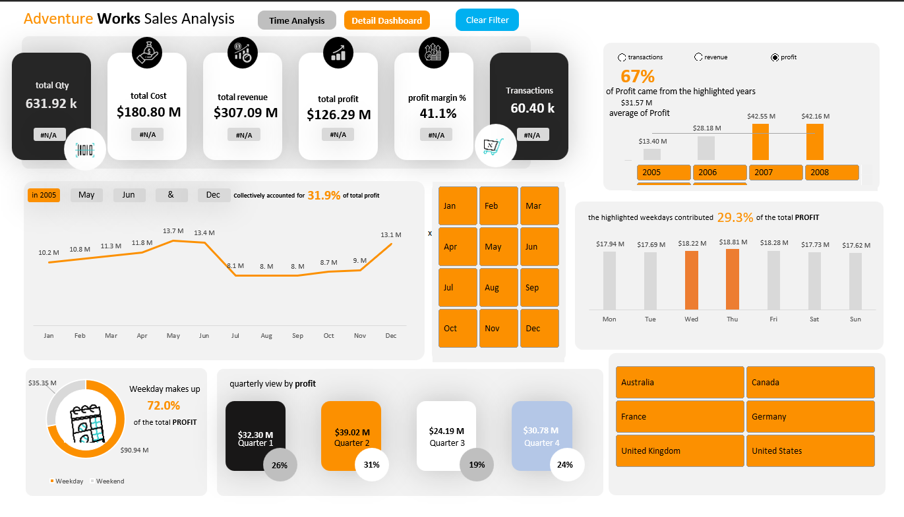
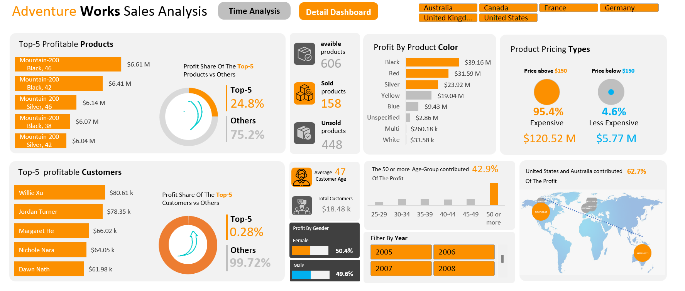

# AdventureWorks Sales Analysis

> An interactive Excel sales analysis exploring business performance across revenue, profitability, products, customers, and time.

`EXCEL` · `POWER QUERY` · `POWER PIVOT` · `DATA MODELING` · `PIVOT TABLES` · `DATA VISUALIZATION`

---

## Project Overview

This project analyzes AdventureWorks sales data using Excel to examine overall business performance and identify patterns across products, customers, and time.

The analysis focuses on key performance indicators such as **revenue, profit, cost, profit margin, transactions, and quantity sold**, while also exploring how performance varies across months, quarters, weekdays, products, customer segments, and other business dimensions.

The final result is presented through two interactive Excel dashboards:

- **Time Analysis Dashboard** — focuses on overall KPIs and sales performance over time.
- **Detail Dashboard** — provides a deeper view of product and customer performance.

The project was built using **Excel, Power Query, Power Pivot, PivotTables, data modeling, formulas, slicers, and interactive dashboard techniques**.

---

## Business Questions

The analysis was designed to answer the following business questions:

- How are **revenue, profit, cost, quantity sold, transactions, and profit margin** performing overall?
- How does business performance change across **months, quarters, years, and weekdays**?
- Which periods contribute the most to overall **revenue and profitability**?
- Which **products and product categories** generate the strongest performance?
- How does performance vary across different **customer segments and demographics**?
- Which **geographic markets** contribute the most to sales?
- What patterns can be identified in **pricing, product characteristics, and customer purchasing behavior**?

---

## Tools & Techniques

| Tool / Technique | Application |
|---|---|
| **Microsoft Excel** | Main environment used for analysis and dashboard development |
| **Power Query** | Used to load and transform the data before analysis |
| **Power Pivot** | Used to work with the data model and support the analysis |
| **Data Modeling** | Structured related data for analysis across multiple business dimensions |
| **PivotTables** | Used to summarize and analyze sales, product, customer, and time-based performance |
| **Excel Formulas** | Used functions such as `IF`, `INDEX/MATCH`, `LARGE`, and `VLOOKUP` to support calculations and dynamic analysis |
| **Slicers** | Added interactive filtering across the dashboards |
| **Charts & Visualizations** | Used to communicate trends, comparisons, contributions, and performance patterns |
| **KPI Analysis** | Tracked revenue, profit, cost, quantity, transactions, and profit margin |
| **Dashboard Design** | Built two interactive dashboards for time-based and detailed business analysis |

---

## Dataset & Data Model

The project uses the **AdventureWorks sales dataset**, organized into a structured data model containing sales transactions and related customer, product, date, and geographic information.

The model includes the following main tables:

- **FactInternetSales** — contains the core sales data used for revenue, cost, profit, quantity, and transaction analysis.
- **DimProduct** — provides product-level information such as product name and color.
- **DimCustomer** — contains customer information used for demographic and customer-level analysis.
- **DimDate** — supports analysis by year, quarter, month, weekday, and other time periods.
- **DimGeography** — provides geographic information for location-based analysis.
- **DimSalesTerritory** — contains sales territory information used for regional analysis.
- **Measures** — contains the calculated measures used throughout the dashboards.

The data was prepared using **Power Query** and connected through the **Excel Data Model / Power Pivot**, allowing the dashboards to analyze information across multiple related tables rather than relying on a single flat dataset.

---

## Data Preparation & Calculations

Before building the dashboards, the data was prepared and structured to support analysis across multiple dimensions.

### Data Preparation

- Loaded and transformed the dataset using **Power Query**.
- Organized the data into separate **fact and dimension tables**.
- Connected the tables through the **Excel Data Model / Power Pivot**.
- Used the date dimension to support analysis across **years, quarters, months, and weekdays**.
- Prepared product, customer, geography, and sales information for use across PivotTables and dashboard visuals.

### Calculations & Analysis

The analysis includes calculations for key business metrics such as:

`Revenue` · `Profit` · `Cost` · `Profit Margin` · `Quantity Sold` · `Transactions`

Additional Excel formulas and supporting calculations were used to create dynamic analysis throughout the workbook, including functions such as:

`IF` · `INDEX/MATCH` · `LARGE` · `VLOOKUP`

These calculations support KPI tracking, contribution analysis, rankings, comparisons, and dynamic dashboard insights.

---

## Dashboard & Analysis

The final analysis is presented through two interactive Excel dashboards, each designed to explore a different side of business performance.

### 1. Time Analysis Dashboard



The **Time Analysis Dashboard** provides an overview of business performance over time and allows users to track the main KPIs while exploring how results change across different periods.

**Key areas of analysis:**

- Revenue, profit, cost, quantity sold, transactions, and profit margin
- Monthly sales and profitability trends
- Year and quarter performance
- Weekday performance and contribution
- Period-over-period KPI comparisons
- Contribution of selected periods to overall profit

Interactive filters allow the dashboard to be explored across different time periods and metrics.

<br>

### 2. Detail Dashboard



The **Detail Dashboard** provides a deeper view of product and customer performance, helping identify which segments contribute most to profitability.

**Key areas of analysis:**

- Top 5 most profitable products
- Available, sold, and unsold products
- Profit by product color
- Product performance across pricing groups
- Top 5 most profitable customers
- Profit contribution of top customers compared with all other customers
- Customer age and age-group analysis
- Profit analysis by gender
- Geographic contribution to profit
- Year-based filtering for detailed exploration

Together, the two dashboards provide both a **high-level view of business performance** and a **more detailed view of the products and customers driving those results**.

---

## Key Insights

- The business generated approximately **$307.09M in revenue** and **$126.29M in profit**, with an overall **profit margin of 41.1%** across **60,398 transactions**.
- **2007 was the strongest year for profitability**, generating approximately **$42.55M in profit** and the highest profit margin at **41.6%**. However, **2008 recorded the highest transaction volume and quantity sold**, with **32,265 transactions** and more than **337K units sold**.
- **May, June, and December** were the three most profitable months, collectively contributing approximately **31.9% of total profit**.
- **Q2 was the strongest quarter**, generating approximately **$39.02M in profit**, representing **30.9% of total profit**.
- Out of **606 products**, only **158 generated sales**, while **448 recorded no sales**. The **Top 5 most profitable products** generated approximately **24.8% of total profit**, with *Mountain-200 Black, 46* ranking first at approximately **$6.61M**.
- Products classified in the **Expensive** price range generated approximately **95.4% of total profit**, showing that profitability was heavily concentrated in higher-priced products.
- Customers aged **50 or older** represented the most profitable age group, contributing approximately **42.9% of total profit**. Profit was almost evenly distributed by gender, with **50.4% from female customers** and **49.6% from male customers**.
- The **United States and Australia** were the two largest geographic contributors to profit, generating approximately **$40.54M** and **$38.70M** respectively.

---

## Business Recommendations

Based on the analysis, the following actions could help improve sales performance and profitability:

- **Prioritize high-value products** — Higher-priced products generate the majority of profit, so maintaining availability and visibility of the strongest-performing premium products should remain a priority.
- **Review the large number of unsold products** — With 448 of 606 products recording no sales, the product portfolio should be reviewed to identify whether these products require better promotion, pricing adjustments, repositioning, or removal.
- **Prepare for high-performing periods** — May, June, and December are the strongest months for profit, while Q2 is the strongest quarter overall. Inventory and marketing efforts could be increased ahead of these periods to take advantage of stronger demand.
- **Protect top-performing products while reducing concentration risk** — The five most profitable products contribute a significant share of total profit. Their performance should be closely monitored while opportunities are explored to grow sales across a broader range of products.
- **Strengthen high-value geographic markets** — The United States and Australia are the largest contributors to profit. These markets could receive greater focus while lower-performing regions are investigated for potential growth opportunities.
- **Use customer segmentation for more targeted strategies** — Customers aged 50+ represent the most profitable age group, suggesting an opportunity for more targeted product positioning and marketing toward this segment.
- **Investigate the drivers behind 2007 performance** — Since 2007 produced the highest profit and profit margin, the product mix, customer activity, and sales patterns from that year could be examined further to identify practices that may be replicated.

---

## Project Files

```text
AdventureWorks-Sales-Analysis/
│
├── README.md
├── AdventureWorks-Sales-Analysis.xlsm
│
└── assets/
    ├── time-analysis-dashboard.png
    └── detail-dashboard.png

```

## Conclusion

This project demonstrates an end-to-end Excel analysis workflow, from **data preparation and modeling to analysis and interactive dashboard development**.

By combining **Power Query, Power Pivot, PivotTables, Excel formulas, and visualization techniques**, the project transforms the AdventureWorks dataset into a structured analysis of **business performance, profitability, products, customers, and time-based trends**.
